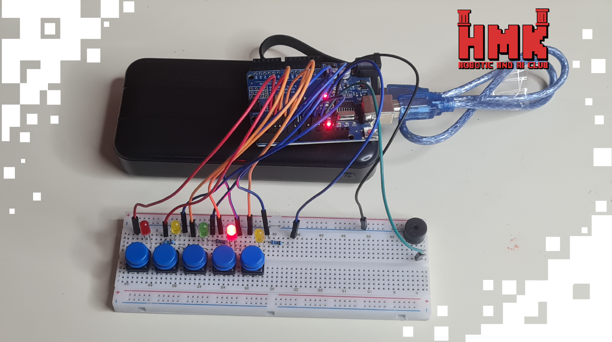

# 💡 Memory Test

## 📅 Project Timeline & Context

- **Event:** FMEE 2025 – **AI & Robotics Club** Open Day
- **Date:** November 10–11–12, 2025

---

## 💡 Project Overview
**Memory Test** is an **interactive electronic game** that challenges a player's ability to remember and reproduce sequences.  
A series of **LEDs** light up in a specific order, and the player must press the corresponding **buttons** in the same sequence to succeed.  

The project aims to create an engaging and educational experience that improves **memory, concentration, and reaction skills** through hands-on electronics.

---

## ⚙️ Components Used
- **Arduino Uno Board** – main microcontroller controlling LEDs and buttons  
- **LEDs** – display the visual light sequence for the player to memorize  
- **Push Buttons** – user input interface for reproducing the LED sequence  
- **Resistors** – regulate current for LEDs and button inputs  

---

## 💻 Software & Tools Used
- **Arduino IDE** – for writing, compiling, and uploading the control program to the Arduino Uno  
- **C/C++** – for programming logic and sequence management  

---

## 👨‍💻 Contributors:
Special thanks to :

- **Malek Shammout** [LinkedIn](https://www.linkedin.com/in/malek-shammout-090523337/)  

---

### 🏁 Key Features
- Dynamic LED light sequences with varying difficulty  
- Real-time button input detection  
- Memory-based challenge with success feedback  
- Compact and easy-to-build electronic setup  

---

### 🚀 Future Enhancements
- Add difficulty levels with increasing sequence lengths  
- Include sound feedback for each light/button press  
- Display score and level on an LCD screen  
- Add multiplayer or timed challenge modes  

---

## 📸 Demo

**Coming soon!**

---

### 📜 License
This project is open-source and available under the [MIT License](LICENSE).

---

**Made with ❤️ to make learning electronics both fun and challenging.**
